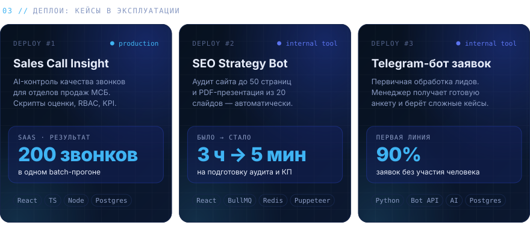
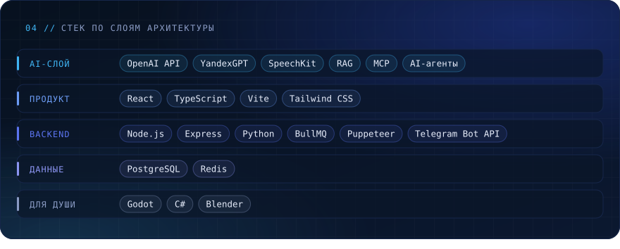
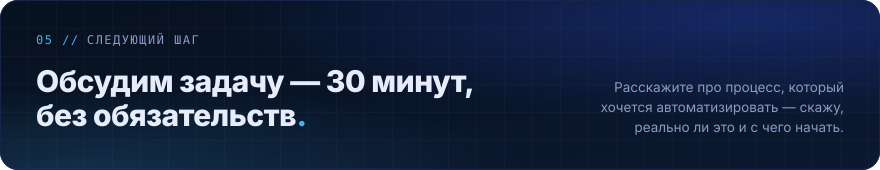

<b>Открытый код и GitHub-статистика</b>

 

| Репозиторий | Что внутри |
|---|---|
| [blog-customizer](https://github.com/kirill-ai-dev/blog-customizer) | Настройщик внешнего вида блога на TypeScript |
| [smart-table](https://github.com/kirill-ai-dev/smart-table) | Динамическая таблица с сортировкой и фильтрацией |
| [sales-bonus](https://github.com/kirill-ai-dev/sales-bonus) | Расчёт бонусов по продажам на JavaScript |

